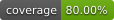

# tgedr-observability


[](https://pypi.org/project/tgedr-observability/)

## overview

This repository is an early-stage observability toolkit built around a small Python package and a companion local monitoring stack. The Docker side is the main operational surface: an OpenTelemetry collector receives telemetry and routes metrics, logs, and traces into dedicated backends for storage and analysis. In practice, the project acts as a foundation for collecting, storing, and exploring observability data rather than as a finished application.

## observability stack

### VictoriaMetrics

`victoriametrics/victoria-metrics` is the metrics database in this stack. It stores time-series data such as request counts, latency measurements, resource usage, and any custom application metrics sent through OpenTelemetry. In this project, the collector forwards metrics to VictoriaMetrics through its OpenTelemetry ingestion endpoint, and Grafana can then query that stored data for dashboards and operational analysis.

### Loki

`grafana/loki` is the log storage backend. Loki is designed to ingest and organize logs efficiently, making it a good fit for centralizing application and infrastructure logs without the overhead of a heavier full-text indexing platform. Here, the OpenTelemetry collector sends log data to Loki so logs can be explored alongside metrics and traces, which makes it easier to correlate failures, warnings, and service behavior across the same time window.

### Jaeger

`jaegertracing/all-in-one` is the distributed tracing backend. It collects and visualizes traces, which show how a request flows across services and how long each span takes, making it useful for debugging latency and request-path failures. The `all-in-one` image bundles Jaeger's main components into a single container, which keeps this setup simple for local or small-scale environments while still providing a usable trace exploration surface.

## securing the collector

**⚠️ Important: The collector requires a valid Bearer token on every request.** The OTLP HTTP receiver is protected with Bearer token authentication using the OpenTelemetry Collector's `bearertokenauth` extension. Any request to the collector endpoint (`localhost:4318` or the remote endpoint) without an `Authorization: Bearer <token>` header will be rejected with HTTP 401 Unauthorized. This applies to all telemetry data—traces, metrics, and logs.

### configuration

1. **Set the token.** Add a strong random secret to your `.secrets` file (which is git-ignored and loaded by `helper.sh`):

   ```bash
   export COLLECTOR_TOKEN="$(openssl rand -hex 32)"
   ```

2. **Rebuild and push the collector image** so the updated config is baked in:

   ```bash
   ./helper.sh build_push_collector
   ```

3. **Start the stack.** The `docker-compose.yml` passes `COLLECTOR_TOKEN` through as an environment variable so the collector reads it at runtime:

   ```bash
   cd docker/observability && docker compose up -d
   ```

### sending telemetry

**All telemetry ingestion requires the token header.** Any client sending OTLP over HTTP must include the `Authorization: Bearer <token>` header on every call, or the request will be rejected:

```
Authorization: Bearer <your-token>
```

**Examples:**

With `telemetrygen` (as used in `helper.sh`):

```bash
telemetrygen traces --otlp-http \
  --otlp-header "Authorization=\"Bearer $COLLECTOR_TOKEN\"" \
  --traces 1
```

With the OpenTelemetry SDK, configure the exporter headers via the `OTEL_EXPORTER_OTLP_HEADERS` environment variable (applied to all outbound requests):

```bash
export OTEL_EXPORTER_OTLP_HEADERS="Authorization=Bearer $COLLECTOR_TOKEN"
```

If the token is missing or invalid, the collector will return `401 Unauthorized`. Verify the token is set correctly in your environment before troubleshooting other issues.


## development
- main requirements:
  - _uv_  
  - _bash_
- Clone the repository like this:

  ``` bash
  git clone git@github.com:jtviegas/observability
  ```
- cd into the folder: `cd observability`
- install requirements: `./helper.sh reqs`
